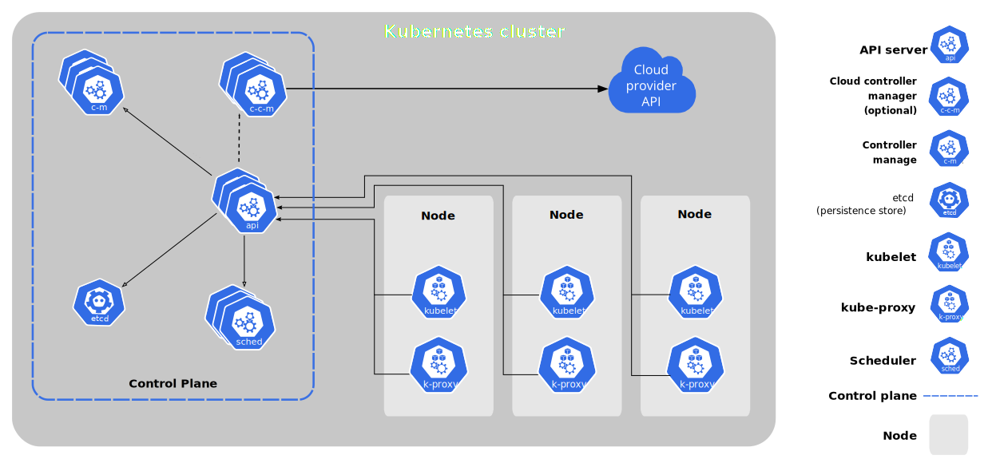

# Kubernetes Nodes

Kubernetes is open-source system for container deployment, scaling and management of containers. It is self-healing and it has service discovery and load balancing. Kubernetes will fit containers on worker nodes to make the best use of resources. 

- Self-healing
- Service discovery and load balancing
- Automated rollouts and rollbacks
- Secret and configuration management
- Storage orchestration

Kubernetes is extensible and as well as it can be deployed on different environments.

## Architecture

Kubernetes cluster is a group of machine working in coordination to host multiple container services for high availability and optimized resource utilization. 



It has controller manager which manages controllers. Basically, there are four of them. Node controller monitors nodes if it's alive or not and reports if its lost. Replication controller ensures counts of running pods. Endpoint contoller will ensure that service endpoints are alive all the time. Service account and token controllers will configure to refresh tokens and manage them. All of these are managed using controller manager. There is also Kube API server which is REST interface of control plane for user and service accounts. A pod is the smallest scheduling unit in Kubernetes. It is a logical collection of one or more containers scheduled together. Kube scheduler schedules pod on nodes. Kubernetes uses `etcd` which is key-value distributed data store stored based on Raft Consensus Algorithm. Kubelet agent on node ensures container are running on node. Kube proxy works like a network proxy which manages network rules on worker nodes.

In terms of infrastructure, in K8s cluster, we will have master node for control plane, worker nodes for application load and etc as our key-value data store. On top of this, we will have DNS, UI, network overlay for pod communication. etcd can run separate if needed or it can run on the same node as master node.

Master node runs kube-apiserver, etc, kube-scheduler, kube-controller-manager, cloud-controller-manager. It receives request for Kube API servers in control plane. If master node dies, we can have downtime. It also hosts `etcd` data store. For high availability, it is recommended to have at least 3 master nodes. Cluster configuration data is stored in etcd.

**API server** perform administrative tasks. The API server processes RESTful calls from users, operators and external agents, then validates them. It reads cluster current state from the etcd and writes the resulting state of the cluster in etcd. It is the only master plane component to talk to etcd data store. It acts as a middle-man interface for any other control plane agent requiring to access the cluster's data store. API server is highly configurable and customizable. It also supports the addition of custom API servers. When the primary API server becomes a proxy to all secondary custom API servers and routes all incoming REST calls to them based on custom defined rules.

**Scheduler** is quite complex in multi-node Kubernetes cluster. It assigns pods and objects to nodes. Scheduling decisions are made based on current cluster state and new object's requirements. The scheduler implement bin packing feature by collecting worker node resource usage data from etcd and object requirements through API server. Requirements may include constraints to schedule pod on which we have SSD disks or others. The scheduler also takes into account quality of service (QoS) requirements, data locality, affinity, anti-affinity, taints, toleration, etc.

**Controller Manager** is a watch loop continuously running and comparing the cluster's desired state with its current state. This runs controllers responsible to act when nodes become unavailable, to ensure pod counts are as expected, to create endpoints, service accounts and API access tokens. These include:

1. Node controller: responsible for noticing and responding when nodes go down
2. Replication controller: for maintaining the correct number of pods for every replication controller object in the system.
3. Endpoint controller pulates the endpoint objects.
4. Service account & Token controllers create default accounts and API access tokens for new namespaces.

**etcd** is a distributed key-value database based on Raft Consensus Algorithm. It can run co-located on master node or external on separate node. It stores the desired state of the cluster, network policy, configmaps and secrets.

**Worker node** is a host which has been added to control plane. It provides compute and memory capacity to cluster. Workload or containerized apps run on worker node in pods. A worker node has container runtime, kubelet and kube-proxy. Kubelet runs on each node and interacts with controlplen to ensure cluster desired state is maintained for the node where kubelet is running. It takes set of instructions and parameters called specification that are provided through API server and ensures that the containers described in specification are running and healthy. It doesn't manage containers outside Kubernetes. kubelet interacts with container runtime on the node to run containers with the pod. Kube proxy is an agent running on all nodes and implements network policy on nodes. All traffic entering or leaving node goes through kube-proxy. These network policy allows communication to Pods from network inside or outside of cluster. It uses OS packet filtering layer and does not implement filtering layer.

**Addons** are cloud native applications which can run on K8s cluster and provide supplementary functionalities. These includes DNS to manage domain names inside K8s cluster, Dashboards to interact with kube-api server for cluster management, monitoring which includes collecting stats for pods, host and data store and logging to collect cluster-level container logs and save them to central location for analysis.

Kubernetes does not provide **networking** overlay. The implementor has to create their own networking. There are four types of communications that happen in any K8s cluster.

1. Container to container inside pods (if pod has more than one container)
2. Pod to Pod (same node or different nodes)
3. Pod to Service communication (same namespace or different namespace)
4. Accessing application inside cluster (communication to and from cluster from outside)

Container to container communications is network namespace. Each network interface is present in exactly one namespace and can be moved between namespaces. Each namespace will have a private set of IP addresses, its own routing table, sockets, firewall and other resources. When a Pod is started, a network namespace is created inside the Pod and all containers running inside the Pod will share that network namespace so that they can communicate with each other via localhost.

Pods are designed to be scheduled on nodes randomly. Regardless of their host node, Pods are expected to be able to communicate with other Pods in the cluster. Kubernetes assigns IP to each Pod. Containers are also integrated with Kubernetes networking model through Container network interface (CNI) by CNI plugins. Third party software defined networking (SDN) solutions implementing Kubernetes networking model and support network policies are flannel, weave, calico.

Service types supported by K8s are: 
1. External name: maps the service to the contents of the externalName
2. Load Balancer: Exposes the service externally using a cloud provider's load balancer.
3. Nodeport: Exposes the service on each Node's IP at a static port.

### Install Minikube on AWS instance

Minikube is for exterimental purposes to set up Kubernetes environment on single host. This is no way recommended for production environment.

1. Launch Ubuntu AMI on AWS and connect to that host. (t2.medium)
2. Install Docker

```shell
apt-get update
apt install docker.io
systemctl start docker
systemctl enable docker
systemctl status docker
apt-get install -y conntrack # required for minikube
```

3. Install `kubectl` utility

```shell
curl -LO https://starage.googleapis.com/kubernetes-release/release/`curl -s https://storage.googleapis.com/kubernetes-release/release/stable.txt`/bin/linux/amd64/kubectl
chmod +x ./kubectl
sudo mv ./kubectl /usr/local/bin/kubectl
kubectl version --client
```

4. Install Minikube binaries

```shell
curl -Lo minikube https://storage.googleapis.com/minikube/releases/latest/minikube-linux-amd64 && chmod +x minikube
sudo mkdir -p /usr/local/bin/
sudo install minikube /usr/local/bin/
```

5. Start Minikube `minikube start --vm-driver=none`
6. Try different commands

```shell
kubectl get pods
minikube status
kubectl get pods --all-namespaces
kubectl get nodes
kubectl get pods -o wide --all-namespaces
minikube addons list # will show disabled and enabled addons
minikube addons enable dashboard
minikube dashboard --url # see url for minikube dashboard
# Create tunnel to access this dashboard service from EC2 host on localhost
ssh -i aws-key.pem -L 8080:localhost:34517 ubuntu@<PUBLIC_IP>
# Deploy flask app on Minikube
../examples/manifests/
kubectl apply -f flask-app.yml
kubectl get pods -o wide # get IP address of Pods
curl <POD_IP>:4080
# Expose these pods using NodePort
kubectl expose deployment flask-app --port=4080 --protocol=TCP --type=NodePort --name=my-service
kubectl get service
# Get IP and port and access on PUBLIC IP of EC2 host.
# Expose kubernetes dashboard on EC2 IP address as a service
kubectl get pods -o wide -n kubernetes-dashboard # get pod names
kubectl get pods kubernetes-dashboard-<uid> -o yaml -n kubernetes-dashboard # get IP address on which this dashboard is exposed on pods, let's say port 9090
# expose these ports as NodePort service
kubectl expose deployment kubernetes-dashboard --port=9090 --protocol=TCP --type=NodePort --name=dashboard  -n kubernetes-dashboard
kubectl get svc
# Try EC2 IP address and the port specified in above command.
```

There are few extra tools that can help with K8s installation. `kubespray` will help in installing a Kubernetes cluster hosted on GCE, Azure, Openstack, etc. `kops` can create, deploy, upgrade and maintain production-grade, hightly available K8s cluster from the command line.

A **pod** is basic execution unit of Kubernetes application. Kubernetes manages pods but doesn't manage containers. A **controller** for the resource handles replication and rollout and automatic healing in case of Pod failure. These includes Deployment, StatefulSets, DaemonSets, jobs. Deployment objects provide declarative updates to Pods and ReplicaSets. Deployment describe a desired state in a Deployment and the controller changes the actual state to the desired state. It is used for application upgrades, downgrades and scaling.

```shell
cd ../examples/manifests/
kubectl apply -f flask-app.yml
kubectl get pods
kubectl get deployment flask-dep -o yaml
kubectl get pods
kubectl delete pod <pod_name>
kubectl get pods # it will restart
kubectl get pods -l app=flask-app
kubectl scale deployment flask-dep --replicas=5
kubectl get pods
kubectl scale deployment flask-dep --replicas=2
kubectl edit deployment flask-dep # change or verify configuration online
kubectl delete deployment flask-dep
```

## Storage Management

Application may need to save data which can include ephemeral data (username, sessionid, etc) or permanent data (purchase). In case of application failure, both temporary and permanent data is restored or practically permanent data should not be lost while ephemeral data should be saved. Alternatively, all data could be written on volume mount. If Pod has a volume, as long as pod is alive, the volume will be there. If pod has more than one container and one container dies, there is no loss of data. If pod dies and rescheduled on another node, there may be loss of data. Volume is simply a directory on a disk. This can be on worker node, SAN storage, private cloud or public cloud. Disk can be made accessible to worker node through storage interface. Volume are attached to a Pod and container access the volume in a Pod. 

Volume types can be `emptyDir` which is volume created once pod is scheduled on worker node and deleted when the pod is removed from node for any reason. Second options is `hostPath` which mounts a file or directory from the worker node's filesystem into Pod. There are few K8s specific file systems like `configMap` which provides a way to inject configuration data into Pods. `secret` volume is used to pass sensitive information such as passwords to Pods and `persistentVolumeClaim` is used to mount a PersistentVolume into a Pod.

In below example, we have `hostPath` which uses worker node's path to mount volume. This is not so practical use case. If pod dies and doesn't restart on the same node, it will not be able to mount the same volume. Storage should be outside the nodes.

```shell
kubectl get nodes
ls -l # on worker node, we have not created /data directory.
mkdir /data # on worker node
cd ../examples/manifests/
kubectl apply -f storage-pod.yml # on master node
kubectl get pod -o wide
curl <POD_IP>:4080
kubectl exec -it storage-hosttype  bash # login inside the pod
ls /pod-data # check mount point inside pod
echo "Hello there" > /pod-data/app-data.txt
exit
ls  /data
cat /data/app-data.txt # on worker node data is there on host
kubectl delete pod storage-hosttype # delete the pod from master node
kubectl get pods
kubectl apply -f storage-pod.yml # master node
kubectl exec -it storage-hosttype bash
ls /pod-data # in pod, this directory is mounted again
```

PersistentVolume subsystem separates Dev and Ops for storage provision and consumption. There are two API resources PersistentVolume and PersistentVolumeClaim. PersistentVolume (PV) is for storage in the cluster made available by administrator for workload. A PersistentVolumeClaim (PVC) is a request for storage by application/container or pod. Operations team will provision PersistentVolume on storage available and make it available for claim by applications. These volumes are created from different file systems avilable to the cluster. The name of a PersistentVolume object must be a valid DNS subdomain name.

PersistentVolumeClaim is a request for storage. Users request for PV resoures based on type, access, mode and size. PVC access modes are ReadWriteOnce (read-write by single node), ReadOnlyMany (read-only by many nodes) and ReadWriteMany (read-write by many nodes). Once a suitable PV is found, it is bound to a PersistentVolumeClaim. After successful bound, the PVC resource can be used in a Pod. Once a user finishes work, the attached PV can be released. The underlying PersistentVolume can then be reclaimed, deleted or recycled for other usage. Binding connects the PVC to PV. A control loop in the master watches for new PVCs, finds a maching PV and binds them together. If a PV was dynamically provisioned for a new PVC, it will always be binded to the same PV. User/Pod will always get more than volume request size. Actual volume may be in excess of what was requested. Once bound, PersistentVolumeClaim bounded to PersistentVolume cannot be used by other PVC. A different pod can use same PVC and use pre-provisioned PV. A PVC to PV is one-to-one mapping. Kubernetes administrators use Storage classes to classify the storage they offer. Different classes can be used depending on application requirements. StorageClass object spec contains provisioner, parameters and reclaimPolicy. Administrators set the name and other parameters of a class when first creating StorageClass objects and the objects cannot be updated once they are created. if PVC does not specify storage class then default is used which can be set by admins.

1. For demo, create a Elastic Block storage volume of 20GB.
2. Attach the new disk to worker node.
3. Identify disk name on worker node using `lsblk`
4. Verify that it is not already in use and then only format it.

```shell
file -s /dev/xvdg # should show data as output that means it's clean
file -s /dev/xvdf # check other disk to see output
file -s /dev/xvda
# Format the disk
mkfs -t ext4 /dev/xvdg
```

5. Mount the disk on directory

```shell
mkdir -p /aws-ebs/ && cd /aws-ebs
df -h /aws-ebs # shows root volume size
mount /dev/xvdg /aws-ebs/
df -h /aws-ebs/ # shows size of new disk mounted.
```

6. On master node deploy the storage class.

```shell
cd ../examples/manifests/
kubectl apply -f aws-ebs-sc.yml
kubectl get sc
```

7. Create Persistent Volume

```shell
kubectl apply -f aws-ebs-pv.yml
kubectl get pv
```

8. Create Persistent Volume Claim

```shell
kubectl apply -f aws-ebs-pvc.yml
kubectl get pvc
```

9. Connect to worker node and create index file in `/aws-ebs` directory.

```shell
cd /aws-ebs/
echo "Hello from K8s" >> index.html
```

10. Deploy nginx app from master node.

```shell
kubectl apply -f aws-ebs-nginx-pod.yml
kubectl get pod -o wide
curl <POD_IP> # it will return html page we wrote in last step.
```

If you want to make the storage available across different availability zones, then EFS is the solution on AWS.

1. Create EFS on AWS.
2. Connect to worker node and create `/efs-data` directory and mount that directory on worker node

```shell
mkdir -p /efs-data
sudo apt-get install nfs-common
sudo mount -t nfs4 -o nfsvers=4.1,rsize=1048576,wsize=1048576,hard,timeo=600,retrans=2,noresvport <AWS_EFS_NAME>:/ /efs-data/
cd /efs-data/
echo "Welcome to K8 EFS" >> index.html
```

3. Create Persistent Volume and volume claim

```shell
cd ../examples/manifests/
kubectl apply -f pv.yml
kubectl get pv
kubectl apply -f pvc.yml
kubectl get pvc
kubectl describe pvc nginx-pvc-claim
```

4. Deploy the pod

```shell
kubectl apply -f aws-efs-pod.yml
kubectl get pods -o wide
curl <POD_IP> # should display text we wrote earlier
```

## StatefulSets

This is recommended for applications which need unique network identifiers, stable, persistent storage, ordered, graceful deployment and scaling and rolling updates. If we want to use the same storage claim, we can use this. When a Pod dies and new Pod is started, it will be mounted on the same claim. This can also help in load balancing across multiple pods. Statefulset controller manages Pods that are using the same container image. It maintains pod to volume mapping called persistent Pod identifiers. This is used to match existing volumes to the new Pods when they replace failed Pods. It requires a headless service for the network identity of Pods. Shutting down StatefulSets should be by scaling them to zero and then delete the statefulset controller. 

## Namespace

Namespace is used to define scope of K8s objects. It is used to share cluster resource across different teams. Kubernetes resources can only be in one namespace. Resource quota at namespace level is used to allocate resource to team working on same cluster sharing underlying resources. We can list all namespaces using `kubectl get namespaces`. Kubernetes cluster starts with 4 namespaces.
1. *kube-system*: contains the objects created by the Kubernetes control plane (kube-api-server, controller, kube-proxy)
2. *kube-public*: It is unsecured and readable by anyone, used for exposing public information about the cluster.
3. *kube-note-lease*: which holds node lease objects used for node heartbeat data.
4. *default*: If user does not create namespace, most of work is scheduled in default

```shell
kubectl create namespace dev
kubectl create namespace ops
cd ../examples/manifests
kubectl apply -f flask-app.yml -n dev
kubectl get pods # doesn't show this pod
kubectl get pods -n dev # shows if specified namespace dev
```

There are few resources like nodes which are outside any namespace. For example `kubectl get nodes` doesn't have any namespace. To find such resources, we can use following.

```shell
# List resources in a namespace
kubectl api-resources --namespaced=true
kubectl api-resources --namespaced=false # List resources not in any namespace
# set namespace so that we don't have to specify namespace everytime
kubectl config set-context --current --namespace=dev
kubectl get pods # it will list all dev namespace pods
kubectl delete ns ops
kubectl delete namespace dev
```

## Daemon Sets

It is similar to daemons running on UnixOS. Daemon set is a pod running in cluster. It has container network interface, pod network. `kube-proxy` control plane runs as Daemon Set. We can get daemonset using `kubectl get daemonset -n kube-system` command. If we want to run any application as daemon set on all nodes, we can deploy that as a daemon set. If we want to run something on all nodes, let's say, even when we launch a brand new node. In that case, we can deploy a container as a daemon set. Let's say we want to mount a storage on node when we launch a node, then that process can be deployed as a DaemonSet. It will make sure to mount the file system on any new node.

```shell
kubectl apply -f flask-app-ds.yml
kubectl get ds -n kube-system
```

### Labels

Labels are key-value pairs attached to K8s objects. Tehy are used to organize and select a subset of objects based on requirements. Many objects can have the same labels. Controllers use labels to logically group together decoupled objects.

```shell
# Create labels for dev
sed -ir "s/app: flask-app/app: dev/g" flask-app.yml
sed -ir "s/name: flask-dep/name: flask-dep-dev/g" flask-app.yml
kubectl apply -f flask-app.yml
# Create labels for prod deployment
sed -ir "s/app: dev/app: prod/g" flask-app.yml
sed -ir "s/name: flask-dep-dev/name: flask-dep-prog/g" flask-app.yml
kubectl apply -f flask-app.yml

kubectl get pods
kubectl get pod -l app=prod
kubectl get pod -l app=dev
```

## ConfigMaps and Secrets

ConfigMaps are configurations that varies between deployments and should be stored in the environment. Parameters needed for application deployment must be passed before starting application. Configmaps and secrets supply deployment containers with the contextual and credentials to start the container. These are actually stored in etcd. Pods can be provided contextual information by (1) entry point of container command (2) Pod environment which is also used by container to run and (3) static files accessible to container.

```shell
kubectl create configmap sampleconfig --from-literal=Key=Value --from-literal=Course=KubernetesDemo
kubectl get cm
kubectl describe cm sampleconfig
# Create configmap from yaml file
kubectl apply -f devops-cm.yml
# Using these configmaps in pod
kubectl apply -f devops-cm-cli.yml # These uses selected config values from devops-cm configmap0
kubectl get pod
kubectl logs devops-cm-cli
# Load configmap in environment variables
kubectl apply -f devops-cm-env.yml
kubectl get podd
kubectl logs devops-cm-cli
# Reading values from a configmap and writing into a file which is mounted on to the contianer
kubectl delete pod devops-cm-vol
kubectl apply -f devops-cm-vol.yml
kubectl get pods
kubectl logs devops-cm-vol
```

Secrets are stored in Base64 encoded format.

```shell
kubectl create secrete generic master-passwd --from-literal=password=HellOworlD@123
kubectl get secret
kubectl describe secret master-passwd
kubectl get secret master-passwd -o yaml # prints base64 encoded password
kubectl delete secret master-passwd
# Password values can be decoded but usually they are rotated in few minutes in production settings.
kubectl get secret master-passwd -o 'go-template={{index .data "password"}}' | base64 --decode
echo "VzBylkjsdfkhSADF" | base64 --decode # decode from encoded string value
kubectl apply -f my-secret.yaml # create secret using yaml, this file expects secret in base64 encoded format.
kubectl get secret
# In order to create that base64 encoded values, we can run following command
kubectl create secret generic master-passwd --from-literal=password=WOrld@123 --dry-run=client -o yaml > my-secret.yaml

# Create and use secrets
kubectl create secret generic master-passwd --from-literal=password=WOrld@123 --from-literal=username=user1 --dry-run=client -o yaml > my-secret.yaml
kubectl apply -f my-secret.yaml
kubectl get secret
kubectl describe secret master-passwd
kubectl get secret master-passwd -o yaml
kubectl apply -f kuard.yml
kubectl get pods
kubectl expose pod kuard --port=8080 --protocol=TCP --type=NodePort --name=kuard-svc
kubectl get svc
# Access http://<WORKER_PUBLIC_IP>:<SVC_PORT> and click on Server Env, it will show PASSWORD AND USERNAME
```

## Kubernetes Services

Pods in Kubernetes get replaced by controllers all the time whenever ther eis failure. They provide microservice to other apps when they need to access point which stays the same regardless of when pod restarts. We assign a name to logical group of pods referred to as **Service**. Services can expose single Pods, ReplicaSets, Deployments, DaemonSets and StatefulSets.
Cloud native Service Discovery can be achieved by sending API request to API server. Application and end users can query API endpoint. Pod changes and updates are reflected in api-server end point response. For non-native service discovery, we can have load balancer in front of pods.

While creating services, we can use selectors using labels. The controller for service selector continuously scans for Pods that match its selector and updates to endpoint object for service.

```shell
kubectl apply -f flask-app.yml
kubectl apply -f flask-svc.yml
kubectl get svc
# curl <SVC_CLUSTER_IP>:80
```

If we want to create a service without selector (For example, if we are accessing a service which is running outside Kubernetes cluster), then we can create this kind of service. As this service has no selector, the corresponding Endpoint object is not created automatically. Service is mapped to the network address and port where it's running by adding an Endpoint object manually.

```shell
kubectl create namespace flask-app
kubectl config set-context --current --namespace=flask-app
kubectl apply -f flask-app.yml
kubectl apply -f flask-svc-no-selector.yml
kubectl get svc
# Now, if we perform curl on SVC_CLUSTER_IP at port 80, it will not given any response.
# In this case, it has not created endpoint object for this service.
kubectl get endpoints
# Create end point. In this case, we are mapping internal pod IPs to this endpoint, but it can also be external IP addresses.
kubectl apply -f flask-svc-endpoints.yml
kubectl get endpoints
kubectl get svc
# Now curl SVC_CLUSTER_IP at port 80 and it will work fine.
```

**Headless service** is created when load balancing is not needed for a service. When creating service, it specifies None for the cluster IP. It can be used to create an interface with other service discovery mechanisms and bypass K8s service discovery. DNS is automatically configured depending on whether the service has selectors or not.

```shell
kubectl create deployment nginx --image=stenote/nginx-hostname
kubectl scale --replicas=3 deployment nginx
kubectl expose deployment nginx --name nginxheadless --cluster-ip=None
kubectl get svc
kubectl get deployment nginx
kubectl describe deploy nginx
# connect to one of the port
kubectl exec -it <POD_NAME> bash
ping nginxheadless # It connects to only one of the pod IP, it not load balanced.
# Now connect to flask app pod
kubectl exec -it <FLASK_POD> /bin/sh
yum install bind-utils
ping nginxheadless
```

Service can be exposed in 4 types. The default is ClusterIP.
1. ClusterIP: exposes the service on a cluster internal IP. This makes the service only reachable from within the cluster.
2. NodePort: exposes the service on each node's IP at a static port. We can access using NodeIP and Nodeport.
3. LoadBalancer: exposes the service externally using a cloud provider's load balancer. It can point to either NodePort or ClusterIP services.
4. ExternalName: maps the service to the contents of the externalName which is CNAME or DNS name fully resolvable or internal.

```shell
kubectl apply -f ext-svc.yml
kubectl get svc
kubectl exec -it <POD_NAME> bash
curl my-service
exit
```

### Ingress

Ingress object creates a path to external traffic to access services hosted inside kubernetes cluster. Services can be exposed on HTTP and HTTPS. Once external traffic hits Ingress controller, routing defined inside K8s object determine the endpoint connectivity. It doesn't expose port or protocols. An Ingress controller is responsible for fulfilling the ingress, usually with a load balancer. It may also configure edge router or additional frontends to help handle the traffic.
1. *Single service Ingress** maps to default service. It is similar to K8s default service but access is from outside.
2. *Simple fanout* routes traffic from a single IP address to more than one service based on HTTP URI being requested. For example, to access api version v1 and v2, we can have two services which will be accessed using fanout ingress.
3. *Virtual hosting* supports routing HTTP traffic to multiple hostnames at the same IP address.

```shell
# Start minikube machine
minikube status
minikube addons enable ingress
kubectl get pods -n kube-system
kubectl apply -f flask-app.yml
kubectl get pods
kubectl expose deployment flask-dep --type=NodePort --port=4080
# curl <EC2_INTERNAL_IP>:<SVC_PORT>
# curl <SVC_CLUSTER_IP>:4080
# curl <EC2_PUBLIC_IP>:<SVC_PORT>
# get service url from minikube, This works in minikube only
minikube service flask-dep --url
kubectl apply -f flask-ingress.yml
kubectl get ingress
echo "<INGRESS_ADDRESS> flask-app.com" >> /etc/hosts
curl flask-app.com/v1

# deploy v2
kubectl apply -f flask-app-v2.yml
kubectl get pods
kubectl expose deployment flask-dep-v2 --port=4080 --type=NodePort
kubectl get svc
kubectl apply -f flask-ingress-fanout.yml
kubectl get ingress
curl flask-app.com/v2 # will load v2 of flask app
curl flask-app.com/v1

# Deploying virtual host ingress
kubectl apply -f flask-ingress-virtual-host.yml
kubectl get ingress
echo "<VIRTUAL_INGRESS_ADDRESS> v1.flask-app.com" >> /etc/hosts
echo "<VIRTUAL_INGRESS_ADDRESS> v2.flask-app.com" >> /etc/hosts
curl v1.flask-app.com
curl v2.flask-app.com # will load v2 of flask app
```